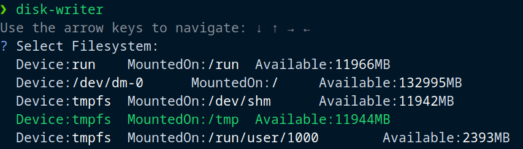
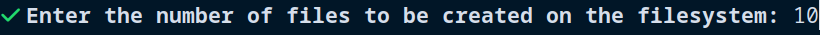
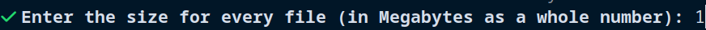
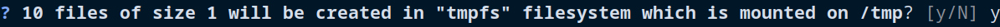

# Goal

> Detect locally mounted disk (make sure it is local) with at least X MB free space, create Z files of size Y, run Z “dd” processes which where each process will fill the selected file with Data and print time took to complete the work.

---

---

# Usage

```bash
go install github.com/temporary-github-user/disk-writer
```

Choose a file system



Enter a number of files to be created



Specify the size for every file



Confirm the choice



---

----

# Thoughs

## Detecting a local file system

Detecting a local file system manually is quite easy. One simply runs `df --local`. However, doing it properly/programmatically requires more efforts. The source code for `coreutils/df` is a bit complicated to comprehend https://github.com/coreutils/coreutils/blob/master/src/df.c .

Thus a decision was taken to simplify this part at the beginning, where by default we treat only `ext4,btrfs,tmps` as locals. However, if a user wants to redefine the behavior, they can simply do

```bash
LOCAL_FILESYSTEM=ext3,zfs,xfs disk-writer
```

---

## Using `dd`

While `coreutils/dd` is quite simple to run as it's, doing so in a code, requires much effort to handle all possible arguments and to parse the given `stdout/stderr`.

To make it more maintainable, `coreutils/dd` where we take the input from `/dev/random` was substituted with the following approach

```go
io.CopyN(filename, rand.Reader, size)
```
